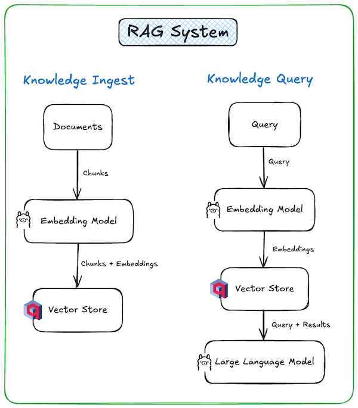
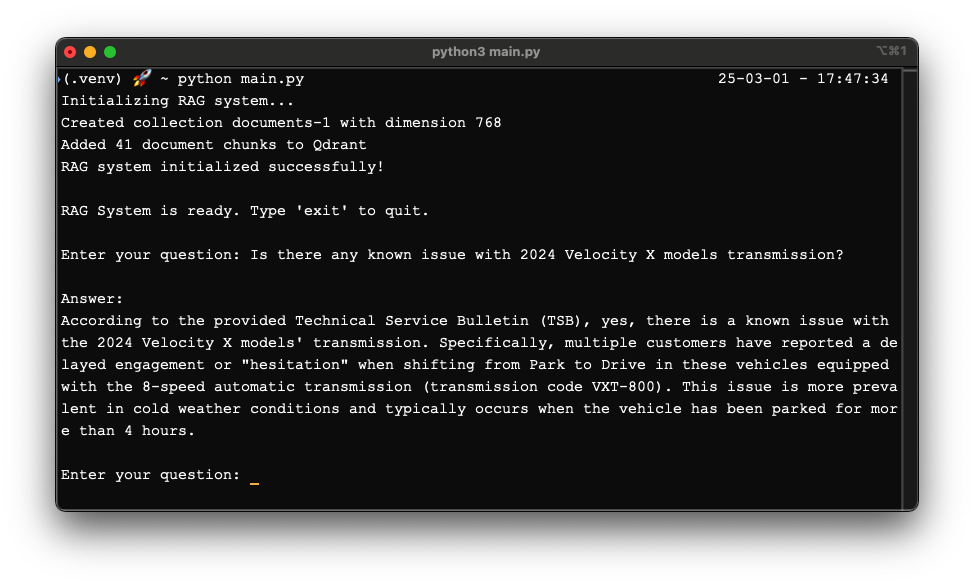

# RAG Application with LangChain, Qdrant, and Ollama

This application implements a Retrieval-Augmented Generation (RAG) system that:
1. Ingest documents into Qdrant vector database
1. Takes user questions as input
2. Retrieves relevant information from a Qdrant vector database
3. Uses the retrieved context to generate accurate answers with locally hosted Ollama models



## Prerequisites

- Python 3.12+
- Docker
- [Ollama](https://ollama.com/) installed and running locally
- Qdrant running locally using docker

## Installation

1. Clone this repository
2. Install the required packages:
```
pip install -r requirements.txt
```
3. Set up environment variables (optional, defaults are set in the code):
```
export OLLAMA_BASE_URL="http://localhost:11434"
export OLLAMA_EMBED_MODEL="nomic-embed-text"
export OLLAMA_LLM_MODEL="llama3"
export QDRANT_URL="http://localhost:6333"
```

## Required Ollama Models

Ensure you have the necessary models pulled in Ollama:

1. For embeddings (you can choose a different embedding model as well):
```
ollama pull nomic-embed-text
```

2. For text generation (you can choose a different LLM):
```
ollama pull llama3
```

## Running the Application

1. Start Qdrant (if running locally):
```
docker run -p 6333:6333 qdrant/qdrant
```

2. Ensure Ollama is running:
```
ollama serve
```

3. Initialize the system with sample documents:
```
python main.py
```



4. See the vector store to check all documents are ingested

    Open link: http://localhost:6333/dashboard#/collections

## Usage

Once the application is running, you will be prompted to input questions. The system will:
1. Convert your question to a vector embedding using Ollama
2. Search the Qdrant database for similar content
3. Retrieve the most relevant document chunks
4. Send your question along with the retrieved context to Ollama
5. Return the generated answer

Type 'exit' to quit the application.

## Future extension ideas

You can extend this application by:
- Adding document loaders for various file types (PDFs, Word documents, websites)
- Implementing a web interface
- Adding document deletion or update functionality
- Incorporating multiple vector stores or different embedding models
- Adding user authentication for multi-user environments
